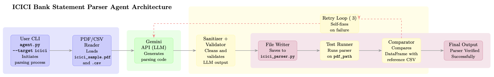

Bank Statement Parser Agent

Overview

This agent automatically generates, saves, and tests a custom PDF-to-CSV parser for ICICI Bank statements using Google Gemini (Generative AI). It reads a sample ICICI PDF, asks Gemini to generate parsing logic, saves it as a Python script, and verifies that the parser’s output matches a reference CSV. The agent retries up to 3 times with intelligent sanitization, import injection, and validation to ensure reliable success.

5-Step Run Instructions

1️⃣ Environment Setup

Install Python 3.9+ and required dependencies:

pip install google-generativeai pandas PyPDF2

2️⃣ Add Data Files

Create the folder structure:

data/icici/

and place these files:

icici_sample.pdf   # Your sample ICICI statement
icici_expected.csv   # Matching reference CSV

3️⃣ Set Gemini API Key

Export your API key as an environment variable:

export GOOGLE_API_KEY="your_real_gemini_api_key"

(Windows PowerShell):

$env:GOOGLE_API_KEY="your_real_gemini_api_key"

4️⃣ Run the Agent

Execute the main script:

python agent.py --target icici

The agent will:

Read and sanitize the PDF

Ask Gemini to generate icici_parser.py

Test the parser against your CSV

Retry up to 3 times if needed

5️⃣ Verify Output

If successful, you’ll see:

✅ Parser output matches CSV!
AGENT SUCCESS: Parser ... passed all tests (T4).

The working parser will be saved to:

custom_parsers/icici_parser.py

Agent Architecture Diagram

